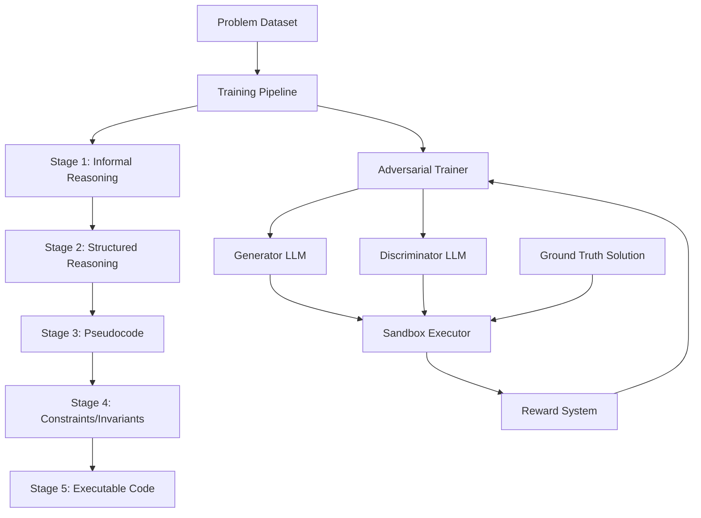
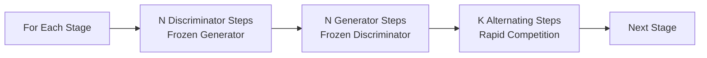

# Design Document

## Overview

This document outlines the technical design for an adversarial reinforcement learning system that trains a generator LLM and discriminator LLM through multi-stage reasoning. The system implements a GAN-inspired approach where both models compete in a zero-sum game: the generator attempts to produce code that passes tests, while the discriminator generates adversarial tests to make the generator fail.

The key innovation is the multi-stage reasoning pipeline where the generator progressively refines its solution through five stages (informal reasoning → structured reasoning → pseudocode → constraints/invariants → executable code), with the discriminator providing adversarial pressure at each stage.

## Architecture

### High-Level System Flow



### Training Loop Architecture



### Component Architecture

The system is organized into the following modules:

1. **models/** - LLM wrappers for generator and discriminator
2. **reasoning/** - Stage definitions and prompt templates
3. **sandbox/** - Secure code execution environment
4. **training/** - RL optimization and adversarial training logic
5. **evaluation/** - Metrics computation
6. **data/** - Problem dataset management

## Components and Interfaces

### 1. Generator LLM (`models/generator.py`)

**Purpose**: Produces multi-stage reasoning outputs and executable code

**Class**: `LLMGenerator`

**Key Methods**:
```python
def __init__(self, model_name: str, device: str = "cpu"):
    """Initialize generator from HuggingFace model"""
    
def generate_stage_output(
    self, 
    problem: str, 
    previous_stages: List[str], 
    stage_id: int
) -> str:
    """Generate output for a specific reasoning stage"""
    
def generate_code(
    self, 
    problem: str, 
    reasoning_chain: List[str]
) -> str:
    """Generate final executable code (stage 5)"""
    
def get_log_probs(self, prompt: str, output: str) -> torch.Tensor:
    """Get log probabilities for RL training"""
```

**Design Decisions**:
- Uses HuggingFace Transformers for model loading
- Supports CPU and GPU execution
- Sanitizes outputs to remove markdown code blocks and malformed syntax
- Maintains conversation history for multi-stage context
- Returns log probabilities for policy gradient computation

### 2. Discriminator LLM (`models/discriminator.py`)

**Purpose**: Generates adversarial test cases and critiques

**Class**: `LLMDiscriminator`

**Key Methods**:
```python
def __init__(self, model_name: str, device: str = "cpu"):
    """Initialize discriminator from HuggingFace model"""
    
def generate_tests(
    self, 
    problem: str, 
    generator_code: str,
    num_tests: int = 5
) -> str:
    """Generate adversarial test cases as Python code"""
    
def generate_critique(
    self, 
    problem: str,
    stage_output: str, 
    stage_id: int
) -> str:
    """Generate critique for a reasoning stage"""
    
def get_log_probs(self, prompt: str, output: str) -> torch.Tensor:
    """Get log probabilities for RL training"""
```

**Design Decisions**:
- Generates test cases as pytest-compatible functions
- Ensures syntactic validity of generated tests
- Provides stage-specific critiques to identify logical flaws
- Returns log probabilities for reward-based training

### 3. Reasoning Stages (`reasoning/stages.py`)

**Purpose**: Define the five-stage reasoning pipeline with prompts

**Data Structure**:
```python
@dataclass
class ReasoningStage:
    id: int
    name: str
    description: str
    generator_prompt_template: str
    discriminator_prompt_template: str

REASONING_STAGES = [
    ReasoningStage(1, "Informal Reasoning", ...),
    ReasoningStage(2, "Structured Reasoning", ...),
    ReasoningStage(3, "Pseudocode", ...),
    ReasoningStage(4, "Constraints and Invariants", ...),
    ReasoningStage(5, "Executable Code", ...)
]
```

**Design Decisions**:
- Each stage has specific prompt templates for both models
- Stages build incrementally on previous outputs
- Templates include examples and formatting instructions
- Stage 5 produces executable Python code

### 4. Sandbox Executor (`sandbox/sandbox.py`)

**Purpose**: Securely execute generated code and tests

**Class**: `Sandbox`

**Key Methods**:
```python
def execute_tests(
    self, 
    code: str, 
    tests: str, 
    timeout: int = 5
) -> ExecutionResult:
    """Execute test cases against code"""
    
def validate_tests_against_solution(
    self,
    tests: str,
    solution: str,
    timeout: int = 5
) -> ExecutionResult:
    """Validate discriminator tests against ground truth"""
```

**Data Structure**:
```python
@dataclass
class ExecutionResult:
    passed: bool
    num_passed: int
    num_total: int
    errors: List[str]
    stdout: str
    stderr: str
    timed_out: bool
```

**Design Decisions**:
- Uses subprocess isolation for security
- Configurable timeout to prevent infinite loops
- Captures all output streams
- Parses pytest output to count passed/failed tests
- Supports validation against ground truth solutions

### 5. Reward System (`training/reward.py`)

**Purpose**: Compute rewards based on test execution results

**Key Functions**:
```python
def compute_generator_reward(
    execution_result: ExecutionResult
) -> float:
    """Reward = test pass rate percentage"""
    return execution_result.num_passed / execution_result.num_total

def compute_discriminator_reward(
    generator_result: ExecutionResult,
    validation_result: ExecutionResult
) -> float:
    """Reward = (1 - generator_pass_rate) * test_validity_score"""
    generator_pass_rate = generator_result.num_passed / generator_result.num_total
    test_validity = validation_result.num_passed / validation_result.num_total
    return (1.0 - generator_pass_rate) * test_validity
```

**Design Decisions**:
- Generator maximizes test pass rate
- Discriminator minimizes generator pass rate
- Discriminator penalized for invalid tests (those that fail ground truth)
- Creates zero-sum competitive dynamic
- All rewards normalized to [0.0, 1.0]

### 6. RL Training Loop (`training/rl_loop.py`)

**Purpose**: Implement policy gradient optimization (PPO/GRPO)

**Key Functions**:
```python
def compute_policy_loss(
    log_probs: torch.Tensor,
    old_log_probs: torch.Tensor,
    rewards: torch.Tensor,
    clip_epsilon: float = 0.2
) -> torch.Tensor:
    """Compute PPO clipped policy loss"""
    
def train_step(
    model: nn.Module,
    optimizer: torch.optim.Optimizer,
    prompts: List[str],
    outputs: List[str],
    rewards: List[float]
) -> Dict[str, float]:
    """Execute one RL training step"""
```

**Design Decisions**:
- Implements PPO with clipped objective
- Supports GRPO as alternative optimization method
- Configurable hyperparameters (learning rate, clip epsilon)
- Returns training metrics for monitoring

### 7. Adversarial Trainer (`training/adversarial_trainer.py`)

**Purpose**: Orchestrate alternating adversarial training

**Class**: `AdversarialTrainer`

**Key Methods**:
```python
def __init__(
    self,
    generator: LLMGenerator,
    discriminator: LLMDiscriminator,
    sandbox: Sandbox,
    config: TrainingConfig
):
    """Initialize trainer with models and configuration"""
    
def train_stage(
    self,
    stage_id: int,
    problems: List[Problem]
) -> StageMetrics:
    """Train both models at a specific reasoning stage"""
    
def train_discriminator_epoch(
    self,
    stage_id: int,
    problems: List[Problem],
    n_steps: int
) -> Dict[str, float]:
    """Train discriminator with frozen generator"""
    
def train_generator_epoch(
    self,
    stage_id: int,
    problems: List[Problem],
    n_steps: int
) -> Dict[str, float]:
    """Train generator with frozen discriminator"""
    
def train_alternating(
    self,
    stage_id: int,
    problems: List[Problem],
    k_steps: int
) -> Dict[str, float]:
    """Alternate between generator and discriminator training"""
    
def train_full_pipeline(
    self,
    problems: List[Problem]
) -> Dict[str, Any]:
    """Train all stages sequentially from bottom to top"""
```

**Training Algorithm**:
```
For each stage (1 to 5):
    # Phase 1: Train discriminator
    freeze(generator)
    for i in range(N):
        tests = discriminator.generate_tests(problem, generator.code)
        gen_result = sandbox.execute_tests(generator.code, tests)
        val_result = sandbox.validate_tests(tests, ground_truth)
        reward = compute_discriminator_reward(gen_result, val_result)
        update_discriminator(reward)
    
    # Phase 2: Train generator
    freeze(discriminator)
    for i in range(N):
        code = generator.generate_code(problem, reasoning_chain)
        tests = discriminator.generate_tests(problem, code)
        result = sandbox.execute_tests(code, tests)
        reward = compute_generator_reward(result)
        update_generator(reward)
    
    # Phase 3: Alternating competition
    for i in range(K):
        if i % 2 == 0:
            train_generator_step()
        else:
            train_discriminator_step()
```

**Design Decisions**:
- Stages trained sequentially (1→2→3→4→5)
- Each stage fully trained before moving to next
- Three-phase training: discriminator epoch, generator epoch, alternating steps
- Model freezing prevents simultaneous updates
- Configurable N (epoch steps) and K (alternating steps)

### 8. Problem Dataset (`data/problem_dataset.py`)

**Purpose**: Manage coding problems with ground truth solutions

**Data Structure**:
```python
@dataclass
class Problem:
    id: str
    description: str
    function_signature: str
    baseline_tests: List[str]
    reference_solution: str
    difficulty: str
    tags: List[str]
```

**Key Functions**:
```python
def load_problems(filepath: str) -> List[Problem]:
    """Load problems from JSON file"""
    
def validate_problem(problem: Problem) -> bool:
    """Ensure problem has valid structure and executable solution"""
```

**Example Problem Format** (`data/example_problems.json`):
```json
{
  "problems": [
    {
      "id": "two_sum",
      "description": "Given an array of integers nums and an integer target, return indices of the two numbers that add up to target.",
      "function_signature": "def two_sum(nums: List[int], target: int) -> List[int]:",
      "baseline_tests": [
        "assert two_sum([2,7,11,15], 9) == [0,1]",
        "assert two_sum([3,2,4], 6) == [1,2]"
      ],
      "reference_solution": "def two_sum(nums, target):\n    seen = {}\n    for i, num in enumerate(nums):\n        complement = target - num\n        if complement in seen:\n            return [seen[complement], i]\n        seen[num] = i\n    return []",
      "difficulty": "easy",
      "tags": ["array", "hash-table"]
    }
  ]
}
```

### 9. Evaluation Metrics (`evaluation/metrics.py`)

**Purpose**: Compute performance metrics

**Key Functions**:
```python
def compute_pass_rate(results: List[ExecutionResult]) -> float:
    """Percentage of tests passed"""
    
def compute_failure_rate(results: List[ExecutionResult]) -> float:
    """Percentage of tests failed"""
    
def compute_test_diversity(test_suites: List[str]) -> float:
    """Measure uniqueness of generated tests"""
    
def compute_reasoning_coherence(reasoning_chain: List[str]) -> float:
    """Measure consistency across reasoning stages"""
```

### 10. Checkpoint Manager (`training/checkpoint_manager.py`)

**Purpose**: Save and load model checkpoints during training

**Class**: `CheckpointManager`

**Key Methods**:
```python
def __init__(self, checkpoint_dir: str = "checkpoints"):
    """Initialize checkpoint manager with storage directory"""
    
def save_checkpoint(
    self,
    generator: LLMGenerator,
    discriminator: LLMDiscriminator,
    stage: int,
    epoch: int,
    metrics: Dict[str, float],
    is_best: bool = False
) -> str:
    """Save model checkpoint with metadata"""
    
def load_checkpoint(
    self,
    checkpoint_path: str,
    generator: LLMGenerator,
    discriminator: LLMDiscriminator
) -> Dict[str, Any]:
    """Load models from checkpoint and return metadata"""
    
def get_best_checkpoint(self) -> Optional[str]:
    """Return path to best performing checkpoint"""
    
def get_latest_checkpoint(self) -> Optional[str]:
    """Return path to most recent checkpoint"""
    
def list_checkpoints(self, stage: Optional[int] = None) -> List[str]:
    """List all available checkpoints, optionally filtered by stage"""
```

**Checkpoint Structure**:
```python
{
    "stage": 3,
    "epoch": 15,
    "generator_state_dict": {...},
    "discriminator_state_dict": {...},
    "metrics": {
        "generator_reward": 0.75,
        "discriminator_reward": 0.68,
        "test_pass_rate": 0.75,
        "test_validity": 0.92
    },
    "timestamp": "2025-11-30T10:30:00",
    "config": {...}
}
```

**Design Decisions**:
- Progressive checkpoints: Save after each stage completion
- Best checkpoint tracking: Keep best model based on combined metrics
- Metadata storage: Include all relevant training information
- Resumable training: Support loading and continuing from any checkpoint
- Disk space management: Optionally keep only N most recent checkpoints

### 11. Inference System (`inference/inference_engine.py`)

**Purpose**: Use trained models to solve new problems

**Class**: `InferenceEngine`

**Key Methods**:
```python
def __init__(
    self,
    generator: LLMGenerator,
    discriminator: LLMDiscriminator,
    sandbox: Sandbox
):
    """Initialize inference engine with trained models"""
    
@classmethod
def from_checkpoint(
    cls,
    checkpoint_path: str,
    device: str = "cpu"
) -> "InferenceEngine":
    """Load inference engine from saved checkpoint"""
    
def solve_problem(
    self,
    problem_description: str,
    function_signature: str = "",
    execute_tests: bool = False,
    test_cases: Optional[List[str]] = None
) -> InferenceResult:
    """Execute multi-stage reasoning to solve a problem"""
    
def solve_batch(
    self,
    problems: List[Problem],
    execute_tests: bool = False
) -> List[InferenceResult]:
    """Solve multiple problems efficiently"""
    
def get_reasoning_chain(
    self,
    problem_description: str
) -> List[str]:
    """Get only the reasoning chain without code execution"""
```

**Data Structure**:
```python
@dataclass
class InferenceResult:
    problem_description: str
    reasoning_chain: List[str]  # Outputs from stages 1-4
    generated_code: str  # Output from stage 5
    execution_result: Optional[ExecutionResult]
    inference_time: float
    stage_times: List[float]  # Time per stage
```

**Inference Flow**:
```
1. Load trained models from checkpoint
2. For each problem:
   a. Stage 1: Generate informal reasoning
   b. Stage 2: Generate structured reasoning (using stage 1 output)
   c. Stage 3: Generate pseudocode (using stages 1-2)
   d. Stage 4: Generate constraints/invariants (using stages 1-3)
   e. Stage 5: Generate executable code (using stages 1-4)
   f. Optionally: Execute code against test cases
3. Return complete reasoning chain and results
```

**Design Decisions**:
- Load from best checkpoint by default
- Support both single and batch inference
- Optional test execution for validation
- Return complete reasoning chain for interpretability
- Track timing metrics for performance analysis
- No training mode - models in eval mode only

## Data Models

### Training Configuration

```python
@dataclass
class TrainingConfig:
    # Model settings
    generator_model: str = "Qwen/Qwen2.5-Coder-1.5B"
    discriminator_model: str = "Qwen/Qwen2.5-Coder-1.5B"
    device: str = "cpu"
    
    # Training hyperparameters
    n_discriminator_steps: int = 10
    n_generator_steps: int = 10
    k_alternating_steps: int = 5
    learning_rate: float = 1e-5
    clip_epsilon: float = 0.2
    
    # Execution settings
    sandbox_timeout: int = 5
    num_tests_per_problem: int = 5
    
    # Multi-attempt settings
    enable_multi_attempt: bool = False
    max_attempts: int = 3
```

### Training State

```python
@dataclass
class TrainingState:
    current_stage: int
    current_epoch: int
    generator_metrics: Dict[str, List[float]]
    discriminator_metrics: Dict[str, List[float]]
    best_generator_reward: float
    best_discriminator_reward: float
    checkpoint_manager: CheckpointManager
```

### Checkpoint Metadata

```python
@dataclass
class CheckpointMetadata:
    stage: int
    epoch: int
    timestamp: str
    metrics: Dict[str, float]
    config: TrainingConfig
    checkpoint_path: str
    is_best: bool
```

### Inference Configuration

```python
@dataclass
class InferenceConfig:
    checkpoint_path: str
    device: str = "cpu"
    max_tokens_per_stage: int = 512
    temperature: float = 0.7
    top_p: float = 0.9
    execute_tests: bool = False
    batch_size: int = 1
```

## Checkpoint Strategy

### Progressive Checkpoints

After each stage completes training, save a checkpoint:
- `checkpoint_stage_1_epoch_10.pt`
- `checkpoint_stage_2_epoch_10.pt`
- `checkpoint_stage_3_epoch_10.pt`
- `checkpoint_stage_4_epoch_10.pt`
- `checkpoint_stage_5_epoch_10.pt`

### Best Checkpoint Tracking

Maintain a separate "best" checkpoint based on combined metrics:
- `checkpoint_best.pt` - Symlink or copy of best performing model
- Metric for "best": Weighted combination of generator reward and test validity
- Formula: `score = 0.7 * generator_reward + 0.3 * test_validity`

### Checkpoint Contents

Each checkpoint file contains:
1. Generator model state dict
2. Discriminator model state dict
3. Optimizer states (for resuming training)
4. Training metrics history
5. Configuration used
6. Stage and epoch information
7. Timestamp

### Resume Training

To resume training from a checkpoint:
```python
checkpoint_manager = CheckpointManager()
latest = checkpoint_manager.get_latest_checkpoint()
metadata = checkpoint_manager.load_checkpoint(latest, generator, discriminator)

# Continue from next stage
start_stage = metadata["stage"] + 1
trainer.train_full_pipeline(problems, start_stage=start_stage)
```

### Disk Space Management

Options for managing checkpoint storage:
1. **Keep All**: Save every stage checkpoint (requires most space)
2. **Keep Last N**: Keep only N most recent checkpoints
3. **Keep Best + Latest**: Keep best checkpoint and latest checkpoint only
4. **Keep Stage Milestones**: Keep one checkpoint per stage completion

Default: Keep all stage checkpoints + best checkpoint

## Error Handling

### Sandbox Errors
- **Timeout**: Kill process and return timeout error
- **Syntax Error**: Capture and return in error list
- **Runtime Error**: Capture exception and continue
- **Import Error**: Allow common libraries, block dangerous imports

### Model Errors
- **Generation Failure**: Retry with temperature adjustment
- **Invalid Output**: Sanitize and attempt to fix, or skip example
- **OOM Error**: Reduce batch size or switch to CPU

### Training Errors
- **NaN Loss**: Clip gradients and reduce learning rate
- **Divergence**: Implement early stopping
- **Checkpoint Corruption**: Maintain multiple checkpoint versions

### Checkpoint Errors
- **Save Failure**: Retry save operation, log error if persistent
- **Load Failure**: Fall back to previous checkpoint or start fresh
- **Corrupted Checkpoint**: Validate checkpoint integrity before loading
- **Missing Checkpoint**: Provide clear error message with available checkpoints

### Inference Errors
- **Model Load Failure**: Check checkpoint path and model compatibility
- **Generation Timeout**: Set reasonable timeout per stage
- **Invalid Problem Format**: Validate input before inference
- **Execution Failure**: Return error in InferenceResult, don't crash

## Testing Strategy

### Unit Tests

1. **Sandbox Tests** (`tests/test_sandbox.py`)
   - Test code execution with valid code
   - Test timeout handling
   - Test error capture
   - Test ground truth validation

2. **Model Tests** (`tests/test_models.py`)
   - Test generator output formatting
   - Test discriminator test generation
   - Test log probability computation
   - Test model loading

3. **Reward Tests** (`tests/test_reward.py`)
   - Test generator reward computation
   - Test discriminator reward computation
   - Test reward normalization
   - Test edge cases (0% pass rate, 100% pass rate)

4. **Stage Tests** (`tests/test_stages.py`)
   - Test stage definitions
   - Test prompt template formatting
   - Test stage progression

### Integration Tests

1. **End-to-End Training** (`tests/test_training.py`)
   - Test single stage training
   - Test full pipeline training
   - Test model freezing
   - Test alternating updates

2. **Dataset Tests** (`tests/test_dataset.py`)
   - Test problem loading
   - Test problem validation
   - Test reference solution execution

3. **Checkpoint Tests** (`tests/test_checkpoint.py`)
   - Test checkpoint saving
   - Test checkpoint loading
   - Test best checkpoint tracking
   - Test resume training from checkpoint
   - Test checkpoint corruption handling

4. **Inference Tests** (`tests/test_inference.py`)
   - Test loading from checkpoint
   - Test single problem inference
   - Test batch inference
   - Test reasoning chain generation
   - Test code execution during inference

### Performance Tests

1. **Execution Speed**: Ensure sandbox executes within timeout
2. **Memory Usage**: Monitor GPU/CPU memory during training
3. **Throughput**: Measure problems processed per minute
4. **Checkpoint I/O**: Measure checkpoint save/load times
5. **Inference Latency**: Measure end-to-end inference time per problem

## Deployment Considerations

### Hardware Requirements

**Minimum (CPU-only)**:
- 16GB RAM
- 4 CPU cores
- 10GB disk space
- Note: CPU-only training will be slow but functional for testing

**Recommended (GPU)**:
- 24GB GPU memory (e.g., RTX 3090, A5000)
- 32GB RAM
- 8 CPU cores
- 50GB disk space

### Free GPU Options

Since the system is designed to work with small models (1.5B parameters), it can run on free GPU platforms:

**Google Colab** (Recommended):
- Free tier: 12GB GPU (T4), 12GB RAM
- Sufficient for Qwen2.5-Coder-1.5B models
- Can run full training pipeline
- Upload code and run in notebook
- Session limit: ~12 hours

**Kaggle Notebooks**:
- Free tier: 16GB GPU (P100/T4), 30GB RAM
- 30 hours/week GPU quota
- Better for longer training runs
- Can save checkpoints to Kaggle datasets

**Lightning AI Studio**:
- Free tier: Limited GPU hours
- Good for development and testing
- Easy environment setup

**Hugging Face Spaces**:
- Free tier with GPU access
- Good for deployment and inference
- Can run training with smaller datasets

**Transfer Methods**:

*Option 1: GitHub (Recommended)*
1. On your computer: Create GitHub repository
   ```bash
   git init
   git add .
   git commit -m "Initial commit"
   git remote add origin <your-repo-url>
   git push -u origin main
   ```
2. In Colab/Kaggle: Clone repository
   ```python
   !git clone https://github.com/yourusername/your-repo.git
   %cd your-repo
   ```

*Option 2: Direct Upload*
1. Zip your project folder on your computer
2. In Colab: Use file upload widget
   ```python
   from google.colab import files
   uploaded = files.upload()  # Upload your zip file
   !unzip your-project.zip
   %cd your-project
   ```
3. In Kaggle: Add as dataset, then import in notebook

*Option 3: Google Drive (Colab only)*
1. Upload project folder to Google Drive
2. In Colab: Mount drive and access files
   ```python
   from google.colab import drive
   drive.mount('/content/drive')
   %cd /content/drive/MyDrive/your-project
   ```

**Setup Instructions for Colab/Kaggle**:
1. Transfer code using one of the methods above
2. Install dependencies: `!pip install -r requirements.txt`
3. Run training: `!python run_training.py`
4. Download checkpoints before session ends:
   ```python
   # In Colab
   from google.colab import files
   files.download('checkpoints/model.pt')
   
   # Or save to Google Drive
   !cp -r checkpoints /content/drive/MyDrive/
   ```

**Recommended Workflow**:
1. Develop and test on your computer (CPU mode)
2. Push to GitHub when ready for GPU training
3. Open Colab/Kaggle and clone from GitHub
4. Run full training with GPU
5. Save checkpoints to Drive/download
6. Pull results back to your computer if needed

### Dependencies

```
torch>=2.0.0
transformers>=4.30.0
accelerate>=0.20.0
pytest>=7.0.0
numpy>=1.24.0
tqdm>=4.65.0
```

### Scalability

- **Multi-GPU**: Use DataParallel or DistributedDataParallel
- **Larger Models**: Support 7B, 13B models with quantization
- **Batch Processing**: Process multiple problems in parallel
- **Checkpointing**: Save model state every N steps

## Inference System Usage

### Basic Inference

```python
# Load trained model from checkpoint
engine = InferenceEngine.from_checkpoint("checkpoints/checkpoint_best.pt")

# Solve a new problem
problem = """
Write a function that finds the longest palindromic substring in a string.
"""

result = engine.solve_problem(
    problem_description=problem,
    function_signature="def longest_palindrome(s: str) -> str:",
    execute_tests=True,
    test_cases=[
        "assert longest_palindrome('babad') in ['bab', 'aba']",
        "assert longest_palindrome('cbbd') == 'bb'"
    ]
)

# Access results
print("Reasoning Chain:")
for i, stage_output in enumerate(result.reasoning_chain, 1):
    print(f"Stage {i}: {stage_output}")

print(f"\nGenerated Code:\n{result.generated_code}")

if result.execution_result:
    print(f"\nTests Passed: {result.execution_result.num_passed}/{result.execution_result.num_total}")
```

### Batch Inference

```python
# Solve multiple problems efficiently
problems = [problem1, problem2, problem3]
results = engine.solve_batch(problems, execute_tests=False)

for result in results:
    print(f"Problem: {result.problem_description[:50]}...")
    print(f"Code: {result.generated_code[:100]}...")
    print(f"Time: {result.inference_time:.2f}s\n")
```

### Reasoning Chain Only

```python
# Get reasoning without code execution
reasoning_chain = engine.get_reasoning_chain(problem_description)

# Useful for:
# - Analyzing model's thought process
# - Debugging reasoning errors
# - Educational purposes
```

## Future Enhancements

1. **Advanced RL Algorithms**: Implement GRPO, DPO as alternatives to PPO
2. **Curriculum Learning**: Start with easy problems, increase difficulty
3. **Meta-Learning**: Learn to adapt quickly to new problem types
4. **Ensemble Methods**: Combine multiple generator/discriminator pairs
5. **Human Feedback**: Incorporate human evaluation of reasoning quality
6. **Larger Datasets**: Scale to thousands of problems from competitive programming
7. **Multi-Language Support**: Extend beyond Python to Java, C++, etc.
8. **Formal Verification**: Integrate theorem provers for correctness guarantees
9. **Checkpoint Compression**: Compress checkpoints to reduce storage requirements
10. **Distributed Inference**: Support distributed inference across multiple GPUs
11. **Streaming Inference**: Stream reasoning stages as they're generated
12. **Fine-tuning API**: Allow users to fine-tune on custom problem domains

## Design Rationale

### Why Multi-Stage Reasoning?

Multi-stage reasoning forces the generator to think through problems systematically rather than jumping directly to code. This mirrors human problem-solving and produces more robust solutions. Each stage provides an opportunity for the discriminator to identify flaws early.

### Why Adversarial Training?

Adversarial training creates a competitive dynamic that pushes both models to improve. The discriminator learns to generate challenging tests, while the generator learns to handle edge cases. This is more effective than training on static test suites.

### Why Bottom-Up Stage Training?

Training stages sequentially from bottom to top ensures that earlier reasoning stages are solid before building on them. Since later stages depend on earlier ones, this dependency ordering is critical for coherent reasoning chains.

### Why Test Execution for Rewards?

Using actual test execution results provides objective, unambiguous rewards. Unlike quality scores from evaluator models, test pass rates are deterministic and directly measure the generator's ability to produce correct code.

### Why Validate Discriminator Tests?

Without validation against ground truth, the discriminator could generate invalid or contradictory tests that penalize correct generator outputs. Validation ensures the discriminator learns to generate hard but fair tests.

### Why Progressive Checkpointing?

Saving checkpoints after each stage allows resuming training from any point, which is critical for long training runs that may be interrupted. It also enables analysis of how models improve across stages and provides fallback options if later stages fail.

### Why Track Best Checkpoint Separately?

Training metrics may fluctuate, and the final checkpoint isn't always the best. Tracking the best checkpoint based on validation metrics ensures we can always access the highest-performing model, even if training continues past the optimal point.

### Why Separate Inference Engine?

Separating inference from training provides a clean API for deployment and evaluation. It ensures models are in eval mode, removes training-specific code, and optimizes for inference speed rather than training throughput.

### Why Return Complete Reasoning Chain?

Returning the full reasoning chain provides interpretability and debugging capabilities. Users can see exactly how the model arrived at its solution, identify where reasoning breaks down, and understand the model's problem-solving approach.
